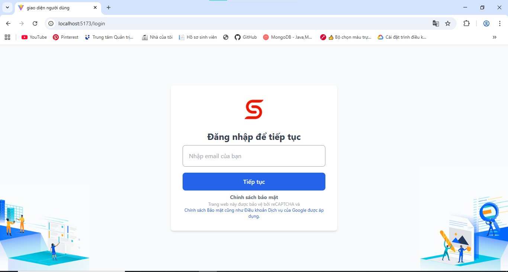
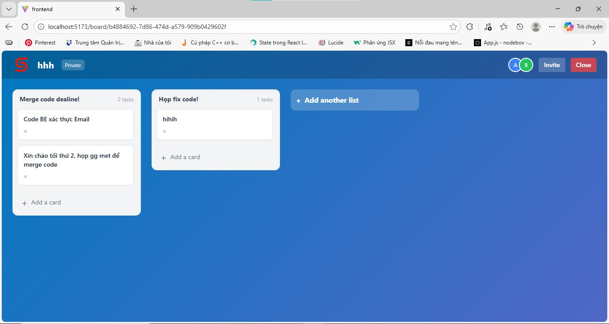
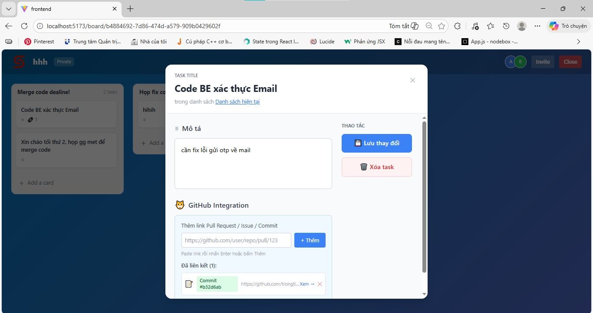

# 🎯 Skipli Board Management - Mini Trello Clone

A real-time board management tool built for Skipli Coding Challenge #5.

---

## 📸 Screenshots

### Login Page


### Dashboard


### Board Detail with Drag & Drop


### Task Modal with GitHub Integration


---

## 🛠️ Tech Stack

### Frontend
- React.js 18 + Vite
- React Router DOM v6
- React Beautiful DnD (drag and drop)
- Socket.io Client (real-time updates)
- Axios (HTTP requests)
- Tailwind CSS (styling)
- React Toastify (notifications)

### Backend
- Node.js + Express.js
- Firebase Admin SDK
- Socket.io (WebSocket)
- JSON Web Token (JWT)
- Nodemailer (email verification)

### Database
- Firebase Firestore

---

## 📁 Project Structure

```
Skipli_Challenge/
├── backend/
│   ├── src/
│   │   ├── config/
│   │   │   └── firebase.js
│   │   ├── controllers/
│   │   │   ├── authController.js
│   │   │   ├── boardController.js
│   │   │   ├── cardController.js
│   │   │   ├── taskController.js
│   │   │   ├── userController.js
│   │   │   └── githubController.js
│   │   ├── middlewares/
│   │   │   └── authMiddleware.js
│   │   └── routes/
│   ├── server.js
│   └── package.json
│
├── frontend/
│   ├── src/
│   │   ├── components/
│   │   ├── pages/
│   │   ├── services/
│   │   └── App.jsx
│   └── package.json
│
├── Screenshot/
│   ├── login.jpg
│   ├── dashboard.jpg
│   ├── board.jpg
│   └── task-modal.jpg
│
└── README.md
```

---

## 🚀 How to Run

### 1. Clone Repository
```bash
git clone https://github.com/trongtinIUH/skipli-board-management.git
cd skipli-board-management
```

### 2. Setup Backend
```bash
cd backend
npm install
```

Create `.env` file in backend folder:
```env
PORT=5000
JWT_SECRET=your_secret_key

FIREBASE_PROJECT_ID=your-project-id
FIREBASE_PRIVATE_KEY="your-private-key"
FIREBASE_CLIENT_EMAIL=your-client-email

EMAIL_USER=your_email@gmail.com
EMAIL_PASS=your_app_password
```

Start backend:
```bash
npm start
```

### 3. Setup Frontend
```bash
cd frontend
npm install
```

Create `.env` file in frontend folder:
```env
VITE_API_URL=http://localhost:5000/api
```

Start frontend:
```bash
npm run dev
```

---

## 📡 API Endpoints

### Authentication
| Method | Endpoint | Description |
|--------|----------|-------------|
| POST | `/api/auth/send-code` | Send verification code |
| POST | `/api/auth/verify-code` | Verify code, get JWT |

### Boards
| Method | Endpoint | Description |
|--------|----------|-------------|
| GET | `/api/boards` | Get all boards |
| POST | `/api/boards` | Create board |
| PUT | `/api/boards/:id` | Update board |
| DELETE | `/api/boards/:id` | Delete board |
| POST | `/api/boards/:id/invite` | Invite member |

### Cards
| Method | Endpoint | Description |
|--------|----------|-------------|
| GET | `/api/boards/:boardId/cards` | Get cards |
| POST | `/api/boards/:boardId/cards` | Create card |
| PUT | `/api/boards/:boardId/cards/:id` | Update card |
| DELETE | `/api/boards/:boardId/cards/:id` | Delete card |

### Tasks
| Method | Endpoint | Description |
|--------|----------|-------------|
| GET | `/api/.../cards/:cardId/tasks` | Get tasks |
| POST | `/api/.../cards/:cardId/tasks` | Create task |
| PUT | `/api/.../tasks/:taskId` | Update task |
| DELETE | `/api/.../tasks/:taskId` | Delete task |
| POST | `/api/.../tasks/:taskId/assign` | Assign member |

### GitHub Integration
| Method | Endpoint | Description |
|--------|----------|-------------|
| GET | `/api/github/repositories/:id/github-info` | Get repo info |
| POST | `/api/github/.../github-attach` | Attach PR/Issue |
| GET | `/api/github/.../github-attachments` | Get attachments |

### Users
| Method | Endpoint | Description |
|--------|----------|-------------|
| GET | `/api/users` | Get all users |
| PUT | `/api/users/:id` | Update user |

---

## ✨ Features

- ✅ Email authentication (no password)
- ✅ Board management (CRUD)
- ✅ Card/List management
- ✅ Task management with drag & drop
- ✅ Member invitation
- ✅ Task assignment
- ✅ GitHub Integration (PR, Issue, Commit)
- ✅ Real-time updates (Socket.io)
- ✅ Responsive design

---

## 👤 Author

**Trong Tin**
- GitHub: [@trongtinIUH](https://github.com/trongtinIUH)